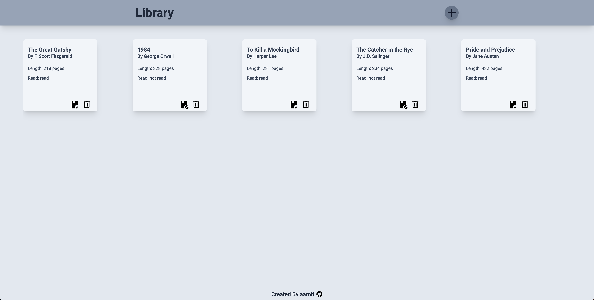

# Library

This is a library app where user can view and add books. The project is part of the [The Odin Project's](https://www.theodinproject.com/) Full Stack JavaScript Course.

## Features

- Users can add books to the library with a new book form.
- Users can mark books read/not read.
- Users can remove books from the library.
- **Users cannot currently edit nor save added books!**

## Live Preview

[Library](https://aarnif.github.io/odin-library/)

## Technologies

- HTML
- CSS
- JavaScript

## Image


Image of the library app.

## Instructions

```
HTTPS - git clone https://github.com/aarnif/odin-library.git

SSH - git clone git@github.com:aarnif/odin-library.git

cd odin-library

open index.html with your browser
```
